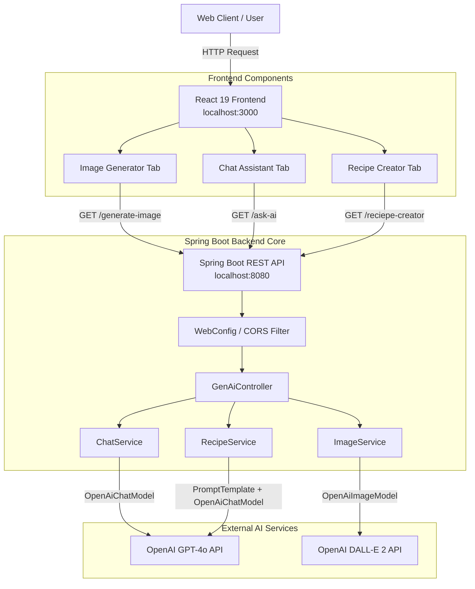

# 🌟 Spring AI Full-Stack Suite

<div align="center">


An enterprise-grade, full-stack generative AI web application showcasing **Spring AI** integration with **OpenAI models (`gpt-4o` and `dall-e-2`)** and a modern multi-tab **React 19** user interface.

</div>

---

## 📖 Overview

This repository demonstrates how to seamlessly integrate **Generative AI** capabilities into a Spring Boot backend and expose rich AI features to a frontend application. The project is split into a decoupled backend and frontend architecture:

* **Backend (`SpringAiDemo/`)**: A robust Spring Boot service utilizing the `spring-ai-starter-model-openai` library. It implements conversational chat completion, customized prompt templating, and prompt-driven AI image generation.
* **Frontend (`spring-ai-demo-react/`)**: A responsive single-page application built with React 19 featuring intuitive tabs for chatting with AI, generating customized artwork, and curating culinary recipes.

---

## ✨ Key Features

### 💬 1. Conversational AI Assistant
* **Model:** OpenAI `gpt-4o`
* **Features:** Supports both standard text completions and highly tuned prompt completions with custom temperature (`0.4`) and token limits (`maxTokens: 200`).

### 🎨 2. AI Image Studio
* **Model:** OpenAI `dall-e-2`
* **Features:** Generate high-resolution digital imagery by specifying custom prompts, number of variations (`n`), and exact pixel dimensions (`width` x `height`). Returns direct URLs to generated visuals.

### 🍳 3. Intelligent Recipe Creator
* **Model:** OpenAI `gpt-4o` via Spring AI `PromptTemplate`
* **Features:** Input available pantry ingredients, target cuisine styles, and specific dietary restrictions to automatically generate complete, structured recipes with step-by-step cooking instructions.

---

## 🏗️ System Architecture



---

## 📂 Directory Structure

```text
SpringAiDemo/
├── SpringAiDemo/                      # Spring Boot Backend Service
│   ├── src/main/java/com/example/SpringAiDemo/
│   │   ├── SpringAiDemoApplication.java # Spring Boot Main Entrypoint
│   │   ├── WebConfig.java               # Global CORS Configuration (localhost:3000)
│   │   ├── GenAiContoller.java          # REST Endpoints for AI Services
│   │   ├── ChatService.java             # GPT-4o Chat Completion Logic
│   │   ├── ImageService.java            # DALL-E 2 Image Generation Logic
│   │   └── RecipeService.java           # PromptTemplate-based Recipe Engine
│   ├── src/main/resources/
│   │   └── application.properties       # Spring application & API Key configuration
│   └── pom.xml                          # Maven build dependencies (Spring AI 1.1.2)
│
└── spring-ai-demo-react/              # React Frontend Application
    ├── src/
    │   ├── components/
    │   │   ├── ChatComponent.js         # Chat Interface Component
    │   │   ├── ImageGenerator.js        # AI Image Generation Component
    │   │   └── RecipeGenerator.js       # AI Recipe Creator Component
    │   ├── App.js                       # Multi-Tab Navigation Container
    │   └── App.css                      # Styling & UI Layout
    └── package.json                     # Node.js dependencies & scripts
```

---

## 🚀 Prerequisites & Local Setup

### 1. System Requirements
* **JDK:** Java 17 or higher
* **Node.js:** v18.x or higher (`npm` v9+)
* **Maven:** v3.8+ (or use the provided `./mvnw` wrapper inside `SpringAiDemo/`)
* **OpenAI API Key:** An active OpenAI API key with access to GPT-4o and DALL-E models.

---

### 2. Configure OpenAI API Key
Before starting the Spring Boot server, configure your OpenAI API Key. You can do this via environment variables or directly inside `application.properties`:

**Option A: Using Environment Variable (Recommended)**
```bash
# On Windows PowerShell
$env:SPRING_AI_OPENAI_API_KEY="sk-proj-your-actual-openai-api-key"

# On Linux / macOS
export SPRING_AI_OPENAI_API_KEY="sk-proj-your-actual-openai-api-key"
```

**Option B: Using `application.properties`**
Open [application.properties](file:///d:/imp/Study/Project/SpringAiDemo/SpringAiDemo/src/main/resources/application.properties) and uncomment/update the key:
```properties
spring.application.name=SpringAiDemo
spring.ai.openai.api-key=sk-proj-your-actual-openai-api-key
```

---

### 3. Start the Backend Server
Navigate to the `SpringAiDemo` directory and start the Spring Boot application:

```bash
cd SpringAiDemo
mvn spring-boot:run
```
> Ensure the backend starts successfully on **`http://localhost:8080`**.

---

### 4. Start the React Frontend
Open a new terminal window, navigate to the React directory, install dependencies, and launch the UI:

```bash
cd spring-ai-demo-react
npm install
npm start
```
> The application will automatically open in your default browser at **`http://localhost:3000`**.

---

## 🔌 API Endpoints Reference

All API endpoints are hosted on `http://localhost:8080` and configured with cross-origin access (`CORS`) for `http://localhost:3000`.

| Method | Endpoint | Query Parameters | Description | Sample Output |
| :---: | :--- | :--- | :--- | :--- |
| `GET` | `/ask-ai` | `prompt` *(string, required)* | Standard conversational completion using default AI model settings. | Plain text response string. |
| `GET` | `/ask-ai-options` | `prompt` *(string, required)* | Customized chat completion using `gpt-4o`, temperature `0.4`, and `maxTokens: 200`. | Concise plain text response string. |
| `GET` | `/generate-image` | `prompt` *(string, required)*<br/>`n` *(int, default: 1)*<br/>`width` *(int, default: 1024)*<br/>`height` *(int, default: 1024)* | Generates `n` DALL-E 2 images matching dimensions (`width` x `height`). | JSON Array of image URLs:<br/>`["https://oaidalleapiprodscus..."]` |
| `GET` | `/reciepe-creator` | `ingredients` *(string, required)*<br/>`cuisine` *(string, default: "any")*<br/>`dietaryRestrcitions` *(string, default: "")* | Generates structured recipes tailored to available pantry items and dietary needs. | Formatted recipe with title, ingredients list, and steps. |

---

## 💡 Example cURL Requests

**1. Ask Chat AI:**
```bash
curl -X GET "http://localhost:8080/ask-ai-options?prompt=Explain%20Spring%20AI%20in%20two%20sentences"
```

**2. Generate a Futuristic Image:**
```bash
curl -X GET "http://localhost:8080/generate-image?prompt=A%20futuristic%20robot%20chef%20cooking%20pasta%20in%20cyberpunk%20kitchen&n=1&width=1024&height=1024"
```

**3. Create a Recipe:**
```bash
curl -X GET "http://localhost:8080/reciepe-creator?ingredients=tomatoes,garlic,spinach,pasta&cuisine=Italian&dietaryRestrcitions=Vegan"
```

---

## 🛠️ Technology Stack

* **Backend Framework:** Spring Boot 3.5.9
* **AI Integration:** Spring AI 1.1.2 (`org.springframework.ai:spring-ai-starter-model-openai`)
* **Java Version:** JDK 17
* **Frontend Framework:** React 19.2.3
* **Build Tools:** Apache Maven & npm
